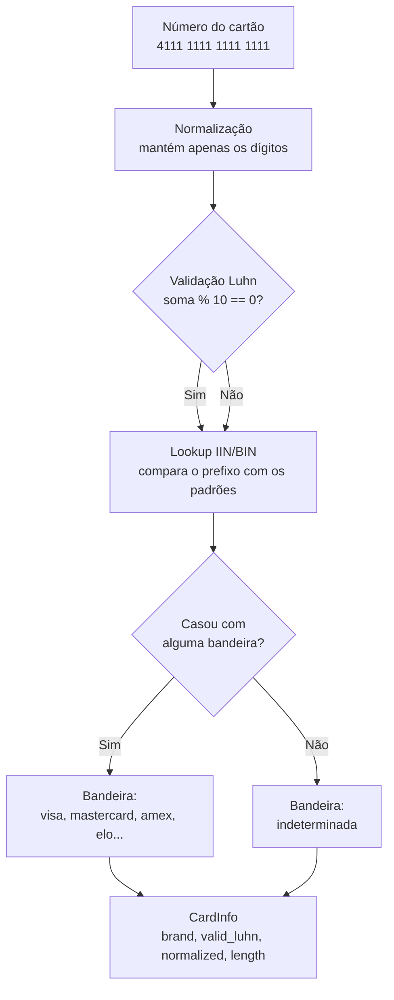

# 🏦 Card Brand Identifier

> Identifique a bandeira de um cartão de crédito e valide o número pelo algoritmo de Luhn em uma única chamada, com zero dependências externas.

[](https://www.python.org/downloads/)
[](LICENSE)
[](pyproject.toml)
[](https://github.com/psf/black)
[](tests/)

Biblioteca Python leve e sem dependências para identificar a bandeira de cartões de crédito a partir dos padrões IIN/BIN e validar o número com o algoritmo de Luhn. Vem com API Python, CLI interativa, Docker e suíte de testes.

```python
from card_brand_identifier import identify_brand

info = identify_brand("4111 1111 1111 1111")
print(info.brand)        # visa
print(info.valid_luhn)   # True
print(info.normalized)   # 4111111111111111
```

## 🔎 Como funciona

O fluxo é simples: o número entra, é normalizado, passa pela validação de Luhn e é comparado com os padrões de prefixo de cada bandeira. O resultado sai empacotado em um objeto `CardInfo`.



A detecção da bandeira e a validação de Luhn são independentes: um número com Luhn inválido ainda tem a bandeira identificada, e vice-versa.

## ✨ Características

- 🎯 **Identificação por IIN/BIN**: 8 bandeiras suportadas (Visa, MasterCard, Amex, Diners, Discover, JCB, Hipercard, Elo).
- ✅ **Validação Luhn**: algoritmo padrão da indústria para checar o dígito verificador.
- 📦 **Zero dependências**: usa apenas a biblioteca padrão do Python (`re`, `dataclasses`, `typing`).
- 🧱 **Objeto tipado**: retorna um `CardInfo` (dataclass) com `brand`, `valid_luhn`, `normalized` e `length`.
- 🧹 **Normalização automática**: aceita números com espaços ou hífens (`"5555-5555-5555-4444"`).
- 💻 **CLI completa**: identificação direta, listagem de bandeiras, modo interativo e testes embutidos.
- 🐳 **Docker pronto**: `Dockerfile` e `docker-compose.yml` inclusos.
- 🧪 **Bem testado**: suíte com dezenas de testes em `pytest`, rodando em múltiplas versões do Python e sistemas operacionais no CI.
- 🔧 **Tooling profissional**: `Makefile`, pre-commit (black, isort, flake8, mypy, bandit, detect-private-key) e pipeline no GitHub Actions.

## 🚀 Instalação

> O pacote ainda não foi publicado no PyPI. A forma recomendada hoje é instalar a partir do código fonte.

### A partir do código fonte

```bash
git clone https://github.com/Ronbragaglia/identificador_bandeira_cartao.ipynb card-brand-identifier
cd card-brand-identifier
pip install -e .
```

### Via Docker

```bash
# Construir a imagem
docker build -t card-brand-identifier .

# Rodar a imagem (mostra a ajuda, que é o comando padrão)
docker run --rm card-brand-identifier

# Identificar um cartão
docker run --rm card-brand-identifier python -m card_brand_identifier.cli 4111111111111111
```

Ou com Docker Compose:

```bash
docker compose run --rm app python -m card_brand_identifier.cli 4111111111111111
```

## ⚡ Quick Start

### Python API

```python
from card_brand_identifier import identify_brand

info = identify_brand("4111 1111 1111 1111")

print(f"Bandeira:    {info.brand}")        # visa
print(f"Válido:      {info.valid_luhn}")   # True
print(f"Normalizado: {info.normalized}")   # 4111111111111111
print(f"Dígitos:     {info.length}")       # 16
```

### CLI

Após `pip install -e .`, o comando `card-identify` fica disponível:

```bash
# Identificar um cartão
card-identify 4111111111111111

# Detalhes completos
card-identify "5555 5555 5555 4444" --verbose

# Listar as bandeiras suportadas
card-identify --brands

# Modo interativo
card-identify --interactive

# Rodar os testes embutidos (números de exemplo)
card-identify --test
```

> 📸 _Placeholder: adicionar aqui um GIF ou screenshot da CLI em ação (a ser gravado pelo mantenedor)._

## 💳 Bandeiras Suportadas

| Bandeira | Prefixos | Comprimento | Exemplo de teste |
|----------|----------|-------------|------------------|
| Visa | 4 | 13, 16, 19 | `4111111111111111` |
| MasterCard | 51-55, 2221-2720 | 16 | `5555555555554444` |
| American Express | 34, 37 | 15 | `378282246310005` |
| Diners Club | 300-305, 36, 38 | 14 | `30569309025904` |
| Discover | 6011, 65, 644-649 | 16 | `6011111111111117` |
| JCB | 2131, 1800, 35 | 16 | `3530111333300000` |
| Hipercard | 3841, 606282 | 16 | `6062825624254001` |
| Elo | Múltiplos prefixos | 16 | `4011780000000002` |

Os números acima são números de teste públicos das próprias operadoras.

## 🎯 Exemplos de Uso

### Validação de formulário

```python
from card_brand_identifier import identify_brand

def validate_credit_card(number: str) -> dict:
    """Valida um cartão em um formulário web."""
    info = identify_brand(number)

    if not info.valid_luhn:
        return {"valid": False, "error": "Número inválido"}

    if not info.brand:
        return {"valid": False, "error": "Bandeira não suportada"}

    return {
        "valid": True,
        "brand": info.brand,
        "last_four": info.normalized[-4:],
    }

result = validate_credit_card("4111 1111 1111 1111")
print(result)
# {'valid': True, 'brand': 'visa', 'last_four': '1111'}
```

### Processamento em lote

```python
from card_brand_identifier import identify_brand

cards = [
    "4111111111111111",
    "5555555555554444",
    "378282246310005",
]

for info in (identify_brand(card) for card in cards):
    status = "OK" if info.valid_luhn else "X"
    print(f"{info.normalized}: {info.brand} ({status})")
```

### Filtrar por bandeira

```python
from card_brand_identifier import identify_brand

cards = [
    "4111111111111111",  # Visa
    "5555555555554444",  # MasterCard
    "4012888888881881",  # Visa
]

visa_cards = [c for c in cards if identify_brand(c).brand == "visa"]
print(visa_cards)
# ['4111111111111111', '4012888888881881']
```

Mais exemplos prontos para rodar em [`examples/basic_usage.py`](examples/basic_usage.py) e [`examples/advanced_usage.py`](examples/advanced_usage.py).

## 🗂️ Estrutura do Projeto

```
.
├── src/card_brand_identifier/
│   ├── __init__.py          # API pública do pacote
│   ├── validator.py         # Núcleo: Luhn + detecção de bandeira (IIN/BIN)
│   └── cli.py               # Interface de linha de comando
├── tests/                   # Suíte de testes (pytest)
├── examples/                # Exemplos de uso (básico e avançado)
├── docs/                    # Documentação (instalação, uso, troubleshooting)
├── Dockerfile               # Imagem Docker
├── docker-compose.yml       # Serviços app, tests e examples
├── Makefile                 # Atalhos de desenvolvimento
├── pyproject.toml           # Metadados e configuração do pacote
└── .pre-commit-config.yaml  # Hooks de qualidade e segurança
```

## 🧪 Testes

```bash
# Rodar todos os testes
pytest

# Com relatório de cobertura
pytest --cov=src --cov-report=html

# Um arquivo ou classe específica
pytest tests/test_validator.py::TestLuhnCheck -v
```

## 🛠️ Desenvolvimento

```bash
# Clonar e entrar no diretório
git clone https://github.com/Ronbragaglia/identificador_bandeira_cartao.ipynb card-brand-identifier
cd card-brand-identifier

# Ambiente virtual
python -m venv .venv
source .venv/bin/activate      # Linux/Mac
.venv\Scripts\activate         # Windows

# Instalar dependências de desenvolvimento
pip install -e ".[dev]"

# Instalar os hooks do pre-commit
pre-commit install
```

Atalhos disponíveis no `Makefile`:

```bash
make help        # Lista todos os alvos
make test        # Roda os testes
make test-cov    # Testes com cobertura
make format      # Formata o código (black + isort)
make check-all   # Formatação + lint + tipos + segurança + testes
make build       # Constrói o pacote
make run-examples # Roda os exemplos básicos
```

## 📚 Documentação

- 📖 [Documentação principal](docs/index.md)
- 🔧 [Guia de instalação](docs/installation.md)
- 💡 [Guia de uso](docs/usage.md)
- 🐛 [Troubleshooting](docs/troubleshooting.md)
- 📝 [Exemplos básicos](examples/basic_usage.py)
- 🚀 [Exemplos avançados](examples/advanced_usage.py)

## 🤝 Contribuindo

Contribuições são bem-vindas. O fluxo sugerido:

1. Faça um fork do repositório.
2. Crie uma branch para a sua feature (`git checkout -b feature/minha-feature`).
3. Commit das suas mudanças (`git commit -m 'Adiciona minha feature'`).
4. Push para a branch (`git push origin feature/minha-feature`).
5. Abra um Pull Request.

Detalhes em [CONTRIBUTING.md](CONTRIBUTING.md).

## 📄 Licença

Distribuído sob a licença MIT. Veja [LICENSE](LICENSE) para o texto completo.

## 📞 Contato

- **Autor**: Rone Bragaglia
- **GitHub**: [@Ronbragaglia](https://github.com/Ronbragaglia)
- 🐛 [Reportar bug ou solicitar feature](https://github.com/Ronbragaglia/identificador_bandeira_cartao.ipynb/issues)

Se este projeto te ajudou, deixe uma ⭐ no repositório. Isso ajuda bastante.

---

⚠️ **Nota de segurança**: esta biblioteca é destinada a fins educacionais e de desenvolvimento. Nunca use números de cartão reais fora de um ambiente que siga as práticas de segurança do PCI-DSS.

⚠️ **Nota legal**: os números usados nos exemplos são números de teste públicos fornecidos pelas operadoras e não representam cartões reais. Use apenas números de teste.
